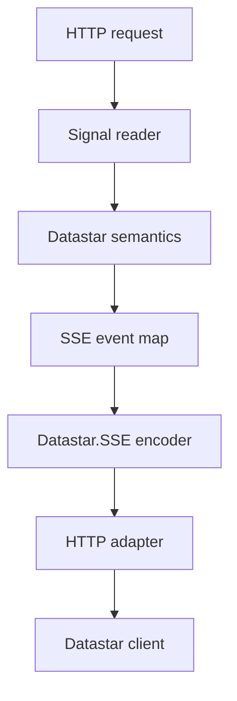
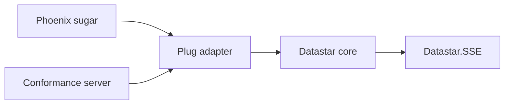

# Datastar SDK core specification for Elixir

**Status:** Draft for implementation  
**Specification version:** 0.3  
**Date:** 2026-09-26  
**Datastar compatibility target:** v1.0.4  
**Minimum Elixir version:** 1.18 (standard-library `JSON`)  
**Project:** `datastar_ex` (package version at time of writing: v0.0.1, pre-release)  
**Scope:** Low-level Datastar event construction, signal reading, transport boundaries, and conformance testing

Changes relative to earlier revisions are explained in the
[specification changelog](#23-specification-changelog).

## 1. Purpose

This document specifies the low-level Datastar SDK functionality built on top of `Datastar.SSE`.

The project is intended to be infrastructure that other Elixir, Plug, Phoenix, and framework-specific packages can trust. Its primary product is not convenience. Its primary product is a small, explicit, stable protocol implementation with unusually strong evidence of correctness.

The implementation has four responsibilities:

1. construct Datastar element-patch events;
2. construct Datastar signal-patch events;
3. construct script-execution events as a defined specialization of element patching; and
4. provide clear boundaries for reading incoming signals and streaming events over HTTP.

The design separates semantic construction from wire encoding and HTTP transport:



The central guarantee is:

> Given valid Datastar operation input, the core constructors produce a deterministic `Datastar.SSE.event()` whose encoded form implements the pinned Datastar SDK contract. The transport adapter can send those events without reinterpreting their semantics, and the complete stack passes both the project's stricter local suite and the official Datastar conformance suite.

This document uses **MUST**, **MUST NOT**, **SHOULD**, **SHOULD NOT**, and **MAY** normatively.

## 2. Normative baseline and source precedence

### 2.1 Pinned upstream baseline

The initial compatibility target is [Datastar v1.0.4](https://github.com/starfederation/datastar/releases/tag/v1.0.4), specifically:

- the [SDK architecture decision record](https://github.com/starfederation/datastar/blob/v1.0.4/sdk/ADR.md);
- [`datastar-sdk-config-v1.json`](https://github.com/starfederation/datastar/blob/v1.0.4/sdk/datastar-sdk-config-v1.json);
- the [official Go-based SDK test suite](https://github.com/starfederation/datastar/tree/v1.0.4/sdk/tests); and
- the released Datastar client behavior associated with v1.0.4.

Tests and documentation MUST refer to a tag or commit, not only to the moving `develop` branch or `@latest` test runner.

### 2.2 Source hierarchy

When sources agree, the shared behavior is normative. When they conflict, the project MUST resolve the conflict explicitly using this order:

1. behavior required by the released Datastar client;
2. the pinned SDK ADR's semantic requirements;
3. the pinned SDK configuration for names, enums, and defaults;
4. the pinned official golden suite;
5. official SDK implementations as informative evidence; and
6. a documented, idiomatic Elixir decision.

The WHATWG Server-Sent Events standard remains normative for SSE framing and interpretation. The separate `Datastar.SSE` specification owns those details.

### 2.3 Known upstream inconsistencies

The local specification MUST not conceal known ambiguity:

| Topic | Upstream observations | Local decision |
| --- | --- | --- |
| `viewTransitionSelector` | Required by the v1.0.4 ADR but absent from the configuration's `datalineLiterals` array | Support it because it is part of the semantic ADR; record the config omission in drift tests |
| Datastar dataline order | ADR examples, ADR implementation lists, and golden fixtures do not always use the same order | Define a deterministic local order; do not claim subgroup order is required by the client |
| Official comparison | The runner groups `data:` values by their first word and ignores order between groups | Add exact local golden tests so deterministic output is tested locally |
| HTML comparison | The runner parses HTML and normalizes attribute order | Choose deterministic attribute order locally and test it exactly |
| Whitespace | The runner uses `TrimSpace` on SSE field values | Test leading/trailing spaces with the WHATWG-oriented SSE suite, not only the official runner |
| Trailing element lines | The ADR requires one `elements` dataline per HTML line but does not define whether template-produced terminal blank lines are meaningful; template renderers commonly append them | Deliberately remove terminal empty or ASCII-whitespace-only logical lines for ecosystem interoperability, preserve all interior lines, and test the decision locally (§6.4) |
| Headers and flushing | The runner requires HTTP 200 but does not assert all SSE headers or flushing behavior | Cover these in Plug integration tests |
| Request methods | The official runner covers GET and POST only | Locally cover GET, DELETE, POST, PUT, PATCH, and other body methods including QUERY |

Passing the official runner is necessary but is not sufficient for this project's correctness claim.

## 3. Design principles

### 3.1 Functional core, explicit effects

Datastar event constructors MUST be pure. They take values and return semantic SSE event maps. They MUST NOT:

- accept or mutate `%Plug.Conn{}`;
- write to sockets;
- start processes;
- schedule heartbeats;
- read application configuration implicitly;
- encode HTTP responses; or
- depend on Phoenix.

HTTP and request-body effects belong in adapters.

### 3.2 Minimal core, optional integration

The first implementation may live in one Mix package, but its module boundaries MUST permit later extraction without redesigning the core API.

The intended future packaging is:

| Possible package | Responsibility | Runtime dependencies |
| --- | --- | --- |
| `datastar_ex` | SSE encoding, pure Datastar event construction, pure signal decoding | none (requires Elixir ≥ 1.18 for the standard-library `JSON` module) |
| `datastar_plug` | `%Plug.Conn{}` streaming and body/query fetching for signal reading | `datastar_ex`, Plug |
| `datastar_phoenix` | `Phoenix.HTML.Safe`, HEEx, components, and Phoenix-specific sugar | core/Plug packages and Phoenix |
| test support | Official conformance server and shared generators | test-only dependencies |

Package extraction is optional. The boundaries are mandatory.

### 3.3 One semantic event model

All Datastar constructors MUST return the event map defined by `Datastar.SSE`:

```elixir
@type Datastar.SSE.event() :: %{
        required(:data) => String.t(),
        optional(:event) => String.t(),
        optional(:id) => String.t(),
        optional(:retry) => non_neg_integer()
      }
```

Datastar modules MUST NOT write `event:`, `id:`, `retry:`, or `data:` prefixes. They construct field values; `Datastar.SSE.encode/1` owns physical SSE framing.

Datastar logical datalines are joined into the event's single `:data` binary:

```elixir
%{
  event: "datastar-patch-elements",
  data: "selector #feed\nmode append\nelements <div>New</div>"
}
```

Encoding that event produces separate physical SSE `data:` fields. This distinction is fundamental:

| Layer | Example | Owner |
| --- | --- | --- |
| Datastar logical dataline | `elements <div>New</div>` | `Datastar.Elements` |
| Semantic SSE data | one binary containing logical lines | Datastar constructor |
| Physical SSE line | `data: elements <div>New</div>\n` | `Datastar.SSE` |

### 3.4 Strict core, convenience outside

The low-level core SHOULD reject invalid types, unknown options, and unsafe line breaks rather than coercing arbitrary terms. Framework-specific packages MAY add ergonomic conversions before calling the core.

### 3.5 Determinism

For the same normalized input under the same supported runtime, constructors
MUST return equal event maps. Encoding those maps MUST produce equal bytes.
Defaults MUST have one canonical representation: omission.

JSON object member order produced by the standard-library `JSON` encoder is
not a cross-Elixir-version compatibility guarantee. JSON objects are
semantically unordered, and `Datastar.Signals.patch/2` deliberately delegates
their textual ordering to `JSON.encode!/1`. Callers that require exact JSON
text or stable member order MUST use `Datastar.Signals.patch_raw/2`. This
exception does not weaken the exact ordering guarantees for Datastar
datalines, SSE fields, script attributes, or caller-supplied raw JSON.

## 4. Module structure and boundaries

The recommended initial layout is:

```text
lib/
  datastar.ex                     # facade
  datastar/
    sse.ex
    elements.ex
    signals.ex
    signals/reader.ex
    script.ex

test/
  datastar_test.exs
  datastar/
    elements_test.exs
    elements_property_test.exs
    signals_test.exs
    signals_property_test.exs
    signals/reader_test.exs
    script_test.exs
    script_property_test.exs

  support/
    datastar_generators.ex
    upstream_fixtures.ex

integration/
  plug/                         # may later become its own package
    lib/datastar/plug.ex
    lib/datastar/plug/signals.ex
    test/

conformance/
  plug_server/                  # executable test-only server
```

The concrete repository may use umbrella applications, optional dependencies, or test-only Mix projects. The dependency direction MUST remain:



No arrow may point from `Datastar.SSE` or the pure core toward Plug or Phoenix.

### 4.1 `Datastar.SSE`

Owns:

- the semantic SSE event type;
- canonical WHATWG-compliant SSE encoding;
- comment encoding;
- SSE field validation; and
- SSE-specific exact, property, interoperability, and WHATWG tests.

Does not own:

- Datastar event names;
- `selector`, `mode`, `elements`, or `signals` datalines;
- HTTP response headers;
- socket writes; or
- request parsing.

Its separate specification remains authoritative.

### 4.2 `Datastar.Elements`

Owns:

- construction and validation of `datastar-patch-elements` events;
- element patch modes and namespaces;
- option-to-dataline mapping;
- prefixing every logical HTML line with `elements `; and
- the `remove/2` convenience constructor.

Does not own:

- HTML parsing or sanitization;
- template rendering;
- HEEx or `Phoenix.HTML.Safe` conversion;
- CSS selector evaluation;
- SSE framing; or
- sending.

### 4.3 `Datastar.Signals`

Owns:

- construction and validation of `datastar-patch-signals` events;
- validating the supported JSON-native Elixir value domain and encoding it via
  the standard-library `JSON` module;
- `onlyIfMissing` semantics;
- prefixing every logical JSON line with `signals `; and
- documentation of RFC 7386 JSON Merge Patch semantics.

Does not own:

- decoding request JSON (that is `Datastar.Signals.Reader`);
- reading Plug request bodies; or
- applying merge patches locally.

### 4.4 `Datastar.Signals.Reader`

The pure, framework-independent HTTP decision core for incoming signal
reading. Owns:

- the method-to-source decision (query parameter versus request body);
- decoding a raw signals binary with the standard-library `JSON` module or a
  caller-supplied decoder;
- requiring a JSON object; and
- the stable error categories for malformed input.

Does not own:

- fetching query parameters;
- reading request bodies;
- enforcing transport size limits; or
- anything touching `%Plug.Conn{}`.

This module exists so that Plug and other HTTP framework integrations reuse one
tested method-to-source decision table and one decoder. A non-HTTP transport
may reuse `decode/2`, but method-to-source selection is intentionally
HTTP-specific.

### 4.5 `Datastar.Script`

Owns:

- safe construction of a `<script>` element from trusted script source;
- script attribute validation and escaping;
- the `auto_remove` behavior; and
- delegation to `Datastar.Elements.patch/2` with `selector: "body"` and `mode: :append`.

It does not introduce a third Datastar event type. Script execution is an element patch.

### 4.6 `Datastar` facade

The top-level `Datastar` module is the primary public surface and MUST exist
from the first release. It mirrors the function names of the official SDKs so
that users arriving from other languages find the expected entry points:

```elixir
defdelegate patch_elements(elements, opts \\ []), to: Datastar.Elements, as: :patch
defdelegate remove_elements(selector, opts \\ []), to: Datastar.Elements, as: :remove
defdelegate patch_signals(signals, opts \\ []), to: Datastar.Signals, as: :patch
defdelegate patch_signals_raw(json, opts \\ []), to: Datastar.Signals, as: :patch_raw
defdelegate execute_script(script, opts \\ []), to: Datastar.Script, as: :execute
```

The facade adds no behavior. It MUST delegate without transforming arguments
or results, and it is part of the stable public contract (§18.1). The facade
and the delegated constructor modules are both public and stable: the facade
is the preferred discovery surface, while the specialized modules expose the
same low-level operations directly.

### 4.7 `Datastar.Plug`

This is an integration boundary, whether it begins inside the repository or in a later package.

Owns:

- SSE response headers;
- starting a chunked/streamed response;
- encoding and chunking semantic events;
- propagating transport errors;
- HTTP-version-specific behavior; and
- an explicit single-writer contract.

It MUST NOT reconstruct Datastar datalines already present in an event.

### 4.8 `Datastar.Plug.Signals`

A thin effectful shell over `Datastar.Signals.Reader`. Owns:

- fetching query parameters when needed;
- reading a body incrementally while enforcing a total size limit;
- mapping an empty body to an empty signal map;
- wrapping adapter read errors; and
- returning the updated connection on both success and failure.

It MUST delegate source selection, decoding, and object validation to
`Datastar.Signals.Reader` rather than duplicating them.

### 4.9 Test and conformance support

Test support owns:

- StreamData generators;
- vendored, pinned upstream fixtures or fixture metadata;
- an executable `/test` endpoint for the official runner; and
- adapters from the suite's JSON event descriptions to the public core API.

Conformance dispatch code MUST NOT become production public API merely because the official suite requires it.

## 5. Shared constants and options

### 5.1 Constants

The v1.0.4 values are:

| Concept | Value |
| --- | --- |
| Datastar query key | `datastar` |
| Element event type | `datastar-patch-elements` |
| Signal event type | `datastar-patch-signals` |
| Default retry duration | `1000` ms |
| Default element mode | `outer` |
| Default namespace | `html` |
| Default view transition | `false` |
| Default only-if-missing | `false` |

Valid patch modes:

```elixir
[:outer, :inner, :remove, :replace, :prepend, :append, :before, :after]
```

Valid namespaces:

```elixir
[:html, :svg, :mathml]
```

Production constants SHOULD be explicit Elixir values, not generated by downloading upstream configuration at compile time. A test or maintenance task SHOULD compare them with a pinned configuration fixture.

### 5.2 Shared event options

The Elixir API uses idiomatic snake-case option names:

| Elixir option | SSE key | Default | Rule |
| --- | --- | --- | --- |
| `:event_id` | `:id` | absent | Include when explicitly supplied, including `""` |
| `:retry_duration` | `:retry` | `1000` | Omit when `1000`; include any other valid non-negative integer |

An empty event ID is meaningful in SSE because it resets the browser's last event ID. The core MUST preserve it rather than treating it as absence.

`retry_duration: 0` is a valid SSE retry instruction and differs from the Datastar default. The core MUST preserve it. This is a deliberate strict reading of the ADR's “unless default of 1000” rule even though some official SDK implementations also omit zero.

Unknown options MUST raise `ArgumentError`.

### 5.3 Event option normalization

Given validated options, constructors MUST behave as if they call:

```elixir
event = %{event: event_type, data: data}

event =
  if Keyword.has_key?(opts, :event_id),
    do: Map.put(event, :id, Keyword.fetch!(opts, :event_id)),
    else: event

event =
  case Keyword.fetch(opts, :retry_duration) do
    :error -> event
    {:ok, 1_000} -> event
    {:ok, retry} -> Map.put(event, :retry, retry)
  end
```

This is semantic pseudocode, not a required implementation.

## 6. Element patch events

### 6.1 Public API

```elixir
@type patch_mode :: :outer | :inner | :remove | :replace |
                    :prepend | :append | :before | :after

@type namespace :: :html | :svg | :mathml

@type patch_option ::
        {:selector, String.t()}
        | {:mode, patch_mode()}
        | {:use_view_transition, boolean()}
        | {:view_transition_selector, String.t()}
        | {:namespace, namespace()}
        | {:event_id, String.t()}
        | {:retry_duration, non_neg_integer()}

@spec patch(iodata() | nil, [patch_option()]) :: Datastar.SSE.event()
def patch(elements, opts \\ [])

@spec remove(String.t(), [patch_option()]) :: Datastar.SSE.event()
def remove(selector, opts \\ [])
```

`patch/2` returns a semantic event; it does not send it.

### 6.2 Option mapping

| Option | Default | Emitted dataline |
| --- | --- | --- |
| `selector: value` | absent | `selector VALUE` |
| `mode: :outer` | `:outer` | omitted |
| non-default mode | — | `mode VALUE` |
| `use_view_transition: false` | `false` | omitted |
| `use_view_transition: true` | — | `useViewTransition true` |
| `view_transition_selector: value` | absent | `viewTransitionSelector VALUE`, only when view transition is true |
| `namespace: :html` | `:html` | omitted |
| non-default namespace | — | `namespace VALUE` |
| elements line | required except selector removal | `elements LINE` |

### 6.3 Canonical dataline order

The event's `:data` binary MUST contain logical datalines in this order:

1. `selector`, if present;
2. `mode`, if non-default;
3. `useViewTransition true`, if enabled;
4. `viewTransitionSelector`, if applicable;
5. `namespace`, if non-default; and
6. one `elements` dataline for every normalized logical HTML line.

The client does not require this subgroup order. The order is local canonicalization for reproducibility.

### 6.4 Elements normalization

When elements are present:

1. input MUST be valid iodata;
2. it MUST be converted once with `IO.iodata_to_binary/1`;
3. the binary MUST be valid UTF-8;
4. CRLF and standalone CR MUST normalize to LF;
5. it MUST be split on LF;
6. trailing logical lines that are empty or consist only of ASCII whitespace
   MUST be removed; interior lines, including empty ones, MUST be preserved
   unchanged; and
7. each remaining component MUST be prefixed with `elements `.

Trailing-line trimming is a deliberate ecosystem-interoperability policy, not
a requirement of the Datastar wire grammar. Template renderers commonly end
rendered output with a newline or indentation-only line. Preserving those
incidental terminators would create empty `elements` datalines, make direct
strings and rendered templates behave differently, and push the same cleanup
into every Phoenix, HEEx, and component adapter.

The core therefore treats only terminal blank logical lines as representation
artifacts. It does not trim the final non-blank line, does not trim leading or
trailing spaces on any retained line, and preserves every empty or
whitespace-only interior line. This is an intentional semantic narrowing: the
low-level API cannot be used to transmit a terminal whitespace-only HTML line
as content. Datastar patches complete elements rather than arbitrary trailing
text fragments, so the interoperability benefit is judged more valuable than
preserving that unusual case. The behavior is part of the public contract and
MUST be covered independently because the official comparator's whitespace
normalization cannot prove it. Input that becomes empty after trimming is
treated as absent elements and follows §6.5.

For example, all of these inputs are equivalent:

```elixir
"<div>Ready</div>"
"<div>Ready</div>\n"
"<div>Ready</div>\n   \n"
```

Example input:

```html
<div>
  <span>Hello</span>
</div>
```

Semantic event:

```elixir
%{
  event: "datastar-patch-elements",
  data: "elements <div>\nelements   <span>Hello</span>\nelements </div>"
}
```

Encoded form:

```text
event: datastar-patch-elements
data: elements <div>
data: elements   <span>Hello</span>
data: elements </div>

```

### 6.5 Required elements and selectors

Elements MUST be non-empty after trailing-line trimming (§6.4) unless all of
these are true:

- `mode` is `:remove`; and
- a non-empty selector is supplied.

When no selector is supplied, the caller is responsible for ensuring that every top-level element has an `id`. The zero-runtime-dependency core SHOULD NOT parse HTML merely to prove this precondition.

`remove/2` MUST require a non-empty selector and behave semantically as:

```elixir
patch(nil, Keyword.merge(opts, selector: selector, mode: :remove))
```

Fixed convenience semantics MUST win over conflicting caller options. `remove/2` MUST therefore reject a conflicting `:mode` or normalize it deterministically rather than silently allowing a non-remove operation. Rejection is preferred.

### 6.6 Validation

The constructor MUST reject:

- invalid iodata;
- malformed UTF-8;
- empty elements outside selector-based removal;
- unknown options;
- duplicate keyword options;
- string modes or namespaces;
- atoms outside the defined enums;
- non-boolean view-transition values;
- non-binary selectors and view-transition selectors;
- empty selectors when supplied;
- CR, LF, or NULL in either selector;
- a view-transition selector when `use_view_transition` is not true;
- invalid event IDs or retry values under the `Datastar.SSE` contract; and
- `nil` as an explicitly supplied option value.

Selectors are treated as opaque CSS selector strings after single-line validation. The core does not prove CSS validity.

### 6.7 Exact examples

Minimal patch:

```elixir
Datastar.Elements.patch(~s(<div id="feed">Hello</div>))
```

```elixir
%{
  event: "datastar-patch-elements",
  data: ~s(elements <div id="feed">Hello</div>)
}
```

Patch with options:

```elixir
Datastar.Elements.patch(
  "<li>New</li>",
  selector: "#feed",
  mode: :append,
  use_view_transition: true,
  namespace: :html,
  event_id: "event-1",
  retry_duration: 2_000
)
```

```elixir
%{
  event: "datastar-patch-elements",
  id: "event-1",
  retry: 2_000,
  data: "selector #feed\nmode append\nuseViewTransition true\nelements <li>New</li>"
}
```

The default `namespace: :html` is omitted.

Removal:

```elixir
Datastar.Elements.remove("#obsolete")
```

```elixir
%{
  event: "datastar-patch-elements",
  data: "selector #obsolete\nmode remove"
}
```

## 7. Signal patch events

### 7.1 Public API

```elixir
@type json_key :: String.t() | atom() | integer()
@type json_scalar :: String.t() | number() | boolean() | nil
@type json_value :: json_scalar() | [json_value()] | json_object()
@type json_object :: %{optional(json_key()) => json_value()}

@type patch_option ::
        {:only_if_missing, boolean()}
        | {:event_id, String.t()}
        | {:retry_duration, non_neg_integer()}

@spec patch(json_object(), [patch_option()]) :: Datastar.SSE.event()
def patch(signals, opts \\ [])

@spec patch_raw(String.t(), [patch_option()]) :: Datastar.SSE.event()
def patch_raw(json, opts \\ [])
```

`patch/2` is the recommended API. It accepts a JSON-native Elixir object,
encodes it with the standard-library `JSON` module (`JSON.encode!/1`, Elixir ≥
1.18), and guarantees an object-shaped JSON merge patch by construction. It
MUST reject non-map input and structs: structs satisfy `is_map/1`, but a
custom `JSON.Encoder` implementation is not guaranteed to encode them as JSON
objects.

The supported value domain is deliberately narrower than every term accepted
by the extensible `JSON.Encoder` protocol. Nested values may be binaries,
finite numbers accepted by `JSON.encode!/1`, booleans, `nil`, lists, and
non-struct maps. Lists MUST be proper lists whose elements are valid values.
Arbitrary atoms as values, tuples, PIDs, references, ports,
functions, and structs at any depth MUST be rejected. Atom and integer map
keys remain supported because the standard encoder represents them as JSON
member names.

Before encoding, every object key MUST be normalized to its JSON member name:
binaries remain unchanged, atoms use `Atom.to_string/1`, and integers use
`Integer.to_string/1`. Every binary key and value MUST be valid UTF-8. If two
keys in the same object normalize to the same name—for example `:count` and
`"count"`—the input MUST be rejected rather than emitting duplicate JSON
members. This validation applies recursively to nested maps.

`patch_raw/2` accepts a pre-encoded JSON binary for callers that bring their
own encoder or need exact control over the wire text. Both functions MUST
share one dataline-construction path; `patch/2` behaves as `patch_raw/2`
after encoding. The raw API is also the escape hatch for custom structs or
other application-specific encoders that intentionally fall outside the
predictable JSON-native domain above.

### 7.2 JSON contract

The `json` argument of `patch_raw/2` MUST:

- be a valid UTF-8 binary;
- be non-empty after checking only for actual absence, not after altering content; and
- contain a valid JSON value appropriate for a Datastar signal merge patch.

JSON grammar validity of raw input is a documented caller precondition:
`patch_raw/2` exists precisely to avoid re-processing already-encoded JSON,
so it MUST NOT decode its input merely to validate it. Callers who want
validation by construction use `patch/2`. Test adapters that already decode
input SHOULD ensure that ordinary signal patches are objects.

The event represents RFC 7386 JSON Merge Patch semantics:

- a property with a non-null value adds or replaces it;
- a property with `null` removes it; and
- nested objects patch recursively.

The core transports the JSON. It does not apply the patch.

### 7.3 Datalines

Canonical order:

1. `onlyIfMissing true`, if enabled;
2. one `signals` dataline for every normalized logical JSON line.

JSON line endings MUST be normalized from CRLF and CR to LF. Trailing empty logical lines MUST be preserved. This deliberately differs from the elements normalization (§6.4): raw JSON is caller-encoded, `patch_raw/2` is faithful transport, and there is no template-render source producing incidental trailing newlines here.

Example:

```elixir
Datastar.Signals.patch(%{count: 2}, only_if_missing: true)
```

or, equivalently:

```elixir
Datastar.Signals.patch_raw(~s({"count":2}), only_if_missing: true)
```

```elixir
%{
  event: "datastar-patch-signals",
  data: ~s(onlyIfMissing true\nsignals {"count":2})
}
```

### 7.4 Multiline JSON

Multiline JSON reaches the wire only through `patch_raw/2`; `patch/2`
produces compact single-line JSON. Given:

```json
{
  "one": 1,
  "two": 2
}
```

the encoded SSE data is:

```text
data: signals {
data: signals   "one": 1,
data: signals   "two": 2
data: signals }
```

`patch_raw/2` does not compact or reformat caller-supplied JSON.

### 7.5 Removing signals

Removing signals is not a distinct wire operation. It is a signal merge patch containing `null` values:

```json
{"one":null,"two":{"alpha":null}}
```

With the map API this is simply:

```elixir
Datastar.Signals.patch(%{"one" => nil, "two" => %{"alpha" => nil}})
```

`nil` encodes as JSON `null`. A future convenience module MAY construct
nested removal patches from dot paths; it MUST delegate to `patch/2` rather
than building datalines itself.

### 7.6 Validation

`patch/2` MUST reject:

- non-map input and structs at any depth;
- terms outside the JSON-native domain defined in §7.1;
- malformed UTF-8 in any binary key or value;
- map keys outside the supported key types;
- duplicate normalized JSON member names within any object; and
- numeric values the standard-library `JSON` encoder cannot represent.

`patch_raw/2` MUST reject:

- non-binary input;
- malformed UTF-8; and
- the empty binary.

Both MUST reject:

- unknown or duplicate options;
- non-boolean `only_if_missing`;
- invalid event IDs; and
- invalid retry values.

Constructor validation failures specified above MUST raise `ArgumentError`
before an event is returned. After validation, an unexpected exception from
`JSON.encode!/1` MUST propagate unchanged so the original encoder failure is
not obscured. `patch/2` MUST NOT rescue arbitrary encoder exceptions and
relabel them as input validation errors.

## 8. Script execution

### 8.1 Public API

```elixir
@type attribute_name :: String.t() | atom()
@type attributes :: %{optional(attribute_name()) => String.t()}

@type execute_option ::
        {:auto_remove, boolean()}
        | {:attributes, attributes()}
        | {:event_id, String.t()}
        | {:retry_duration, non_neg_integer()}

@spec execute(String.t(), [execute_option()]) :: Datastar.SSE.event()
def execute(script, opts \\ [])
```

Script source is trusted executable code. This API is not a JavaScript sanitizer and MUST be documented accordingly.

### 8.2 Defined expansion

`execute/2` MUST:

1. validate the script and options;
2. create one `<script>` element;
3. add `data-effect="el.remove()"` when `auto_remove` is true or absent;
4. omit that attribute when `auto_remove` is false;
5. call `Datastar.Elements.patch/2` with `selector: "body"` and `mode: :append`; and
6. forward the shared event options.

Therefore, script execution produces `datastar-patch-elements`, never a custom event type.

### 8.3 Attribute handling

Attribute handling MUST be deterministic and safe:

- attribute names are converted to strings;
- names MUST match `\A[A-Za-z0-9_:.-]+\z`;
- values MUST be binaries;
- values MUST escape `&`, `"`, `<`, and `>` for an HTML attribute context;
- attributes MUST be sorted by normalized name before rendering;
- duplicate normalized names MUST be rejected; and
- when `auto_remove` is true, `data-effect` is reserved.

If callers supply `data-effect` while `auto_remove` is true, the constructor MUST either accept the identical value exactly once or raise. It MUST reject a conflicting value. Raising on any explicit conflict is the preferred simple policy.

### 8.4 Script element breakout

HTML parsing terminates a script element at a case-insensitive `</script` sequence. The constructor MUST neutralize such sequences inside the script source, for example by converting them to `<\/script` while preserving JavaScript string semantics.

This defense prevents a trusted script containing HTML-like data from accidentally breaking out of the generated element. It does not make untrusted JavaScript safe to execute.

### 8.5 Example

```elixir
Datastar.Script.execute(
  "console.log('hello')",
  auto_remove: false,
  attributes: %{"type" => "module"},
  event_id: "event-1",
  retry_duration: 2_000
)
```

Semantic result, using the canonical element ordering:

```elixir
%{
  event: "datastar-patch-elements",
  id: "event-1",
  retry: 2_000,
  data: "selector body\nmode append\nelements <script type=\"module\">console.log('hello')</script>"
}
```

The official suite's expected sample writes `mode` before `selector`; its comparison intentionally ignores order between Datastar data subgroups. The local constructor uses `Datastar.Elements` ordering consistently.

### 8.6 Validation

The constructor MUST reject:

- non-binary or malformed UTF-8 script source;
- unknown or duplicate options;
- non-boolean `auto_remove`;
- non-map attributes;
- invalid or duplicate normalized attribute names;
- non-binary attribute values;
- conflicting reserved attributes; and
- invalid shared event options.

An empty script MAY be accepted. It is still a valid script element and avoids inventing a restriction absent from the upstream contract.

## 9. Incoming signals

Incoming signal reading splits into a pure HTTP decision core and an effectful
HTTP shell. `Datastar.Signals.Reader` owns the method-to-source rule and JSON
object decoding that can be decided from values alone; the adapter owns only
fetching, size limits, and connection state.

### 9.1 Pure reader API

`Datastar.Signals.Reader` SHOULD expose:

```elixir
@type decode_error :: :invalid_json | :not_an_object
@type decoder :: (binary() -> {:ok, term()} | {:error, term()})
@type decode_option :: {:decoder, decoder()}

@spec source(method :: String.t()) :: :query | :body

@spec decode(binary(), [decode_option()]) ::
        {:ok, map()} | {:error, decode_error()}

def decode(json, opts \\ [])
```

`source/1` implements the data-location table in §9.3 and MUST compare
methods case-insensitively. A non-binary method MUST raise `ArgumentError`.

`decode/2` MUST:

- decode with the standard-library `JSON.decode/1` by default;
- accept a `:decoder` option with the contract
  `(binary() -> {:ok, term()} | {:error, term()})` so applications can
  substitute another JSON implementation without a core dependency change;
- return `{:error, :invalid_json}` for undecodable input, including the
  empty binary; and
- return `{:error, :not_an_object}` for a decoded array, scalar, null, or
  struct.

`decode/2` MUST reject non-binary input, unknown or duplicate options, and a
non-unary `:decoder` with `ArgumentError`. A decoder result outside the documented
`{:ok, term()} | {:error, term()}` contract is also a programmer error and
MUST raise `ArgumentError`. A well-shaped `{:error, reason}` from any decoder
maps to `{:error, :invalid_json}`. Exceptions raised by a caller-supplied
decoder propagate unchanged; the reader MUST NOT disguise application code
failures as malformed request data.

Missing input (an absent query key, an empty body) never reaches `decode/2`;
mapping absence to an empty signal map is the adapter's job, because "absent"
means different things per source (§9.4, §9.5).

### 9.2 Plug API

A Plug adapter SHOULD expose:

```elixir
@type read_error ::
        :invalid_json
        | :not_an_object
        | :too_large
        | {:read_body, term()}

@spec read_signals(Plug.Conn.t(), keyword()) ::
        {:ok, map(), Plug.Conn.t()}
        | {:error, read_error(), Plug.Conn.t()}
```

The updated connection MUST always be returned because reading a Plug request body updates adapter state. Decoding errors are those of
`Datastar.Signals.Reader.decode/2`, passed through unchanged.

### 9.3 Data location

| Method | Source |
| --- | --- |
| `GET` | URL-decoded `datastar` query parameter |
| `DELETE` | URL-decoded `datastar` query parameter |
| every other method | JSON request body or already parsed body params |

Using “every other method” intentionally supports Datastar's `QUERY` action as well as POST, PUT, and PATCH.

The method comparison SHOULD be case-insensitive at a framework-independent boundary; `%Plug.Conn{}` normally supplies uppercase methods.

### 9.4 Query behavior

For GET and DELETE:

- query parameters MUST be fetched if needed;
- a missing `datastar` key returns an empty map without calling `decode/2`;
- `datastar=` is present input and MUST be passed to `decode/2`, producing `:invalid_json` for the empty string;
- the decoded value MUST be a JSON object; and
- the adapter SHOULD enforce a configurable query-size limit before decoding.

### 9.5 Body behavior

For body methods:

- if a JSON parser has already produced object-shaped body params, the adapter MAY use them;
- if params are unfetched, the adapter MUST read the raw body;
- repeated `{:more, chunk, conn}` results MUST be accumulated;
- the total accumulated byte count MUST be limited, not merely each individual read;
- the default maximum SHOULD be `1_000_000` bytes;
- an empty body returns an empty map without calling `decode/2`;
- all other bodies are passed to `Datastar.Signals.Reader.decode/2`, whose
  `:invalid_json` and `:not_an_object` errors pass through; and
- adapter read errors are wrapped as `{:read_body, reason}`.

The JSON decoder defaults to the standard-library `JSON.decode/1`. The
adapter MUST forward a caller-supplied `:decoder` option to the reader
unchanged, so applications can adapt modules such as Jason to the function
contract without a core dependency.

### 9.6 Ordering constraint

Signals MUST be read before starting the SSE response. Once the response is chunked, malformed input can no longer receive a normal 400 or 413 response.

The recommended request flow is:

```text
read and validate signals
        ↓
authorize and perform application work
        ↓
start SSE response
        ↓
send events
```

## 10. Plug transport

### 10.1 Suggested API

```elixir
@spec start(Plug.Conn.t(), keyword()) :: Plug.Conn.t()
def start(conn, opts \\ [])

@spec send_event(Plug.Conn.t(), Datastar.SSE.event()) ::
        {:ok, Plug.Conn.t()} | {:error, term()}
def send_event(conn, event)

@spec send_event!(Plug.Conn.t(), Datastar.SSE.event()) :: Plug.Conn.t()
def send_event!(conn, event)

@spec send_comment(Plug.Conn.t(), String.t()) ::
        {:ok, Plug.Conn.t()} | {:error, term()}
def send_comment(conn, comment)
```

`send_event/2` MUST call `Datastar.SSE.encode/1` and then `Plug.Conn.chunk/2`. It MUST NOT special-case element, signal, or script events.

### 10.2 Response initialization

`start/2` MUST:

- require a connection whose response has not been sent;
- set `content-type` to `text/event-stream`;
- set `cache-control` to `no-cache`;
- set `connection: keep-alive` only when `Plug.Conn.get_http_protocol/1` returns `:"HTTP/1.1"`;
- avoid `connection` on HTTP/2 and HTTP/3;
- remove or avoid a `content-length` header;
- call `Plug.Conn.send_chunked/2` with status 200 by default; and
- return the resulting connection in `:chunked` state.

Calling `send_chunked/2` sends the response headers immediately. Under HTTP/2, Plug streams the response without the HTTP/1.1 transfer-encoding mechanism while retaining the same API.

Compression is outside the core transport. Documentation MUST warn that buffering compression middleware can delay event delivery.

### 10.3 Error behavior

`send_event/2` returns:

- `{:ok, conn}` on a successful chunk;
- `{:error, reason}` on transport failure; and
- raises `ArgumentError` before writing if the semantic event is invalid.

The bang variant raises a transport-specific exception or `RuntimeError` carrying the original reason. It MUST not discard the reason.

### 10.4 Ordered delivery and ownership

A stream MUST have one logical writer. The initial Plug adapter SHOULD state that the request process owns the `%Plug.Conn{}` and serializes all writes.

The adapter MUST NOT claim thread safety merely because Elixir data is immutable. Concurrent processes holding copies of a connection do not provide ordered, coordinated socket ownership.

A future package MAY introduce a dedicated writer process with:

- a mailbox-defined total order;
- explicit close semantics;
- monitored owner/client lifecycle;
- backpressure policy; and
- synchronous send acknowledgements.

That process is not required for the low-level first milestone.

### 10.5 Heartbeats

The transport MAY expose `send_comment/2` for caller-driven heartbeat comments. Scheduling, intervals, supervision, and liveness policy remain outside the low-level adapter.

### 10.6 Telemetry (deferred)

`:telemetry` instrumentation of the transport boundary — event sent, chunk
failed, signals read or rejected — is the Elixir ecosystem convention for
infrastructure libraries and is a natural fit for the Plug adapter, not the
pure core.

It is **deliberately deferred** from the currently specified development
stages, and `:telemetry` is not an initial dependency. This is a scope
decision, not an oversight, but it does not prohibit adding instrumentation
before 1.0 if real adapter usage demonstrates the need. When it is added it
belongs in the adapter layer, MUST NOT leak into the pure constructors, and
MUST be introduced with documented event names, measurements, metadata, and
compatibility expectations.

### 10.7 Read-side stream loop

The adapter's contract in §10.1–§10.5 is unchanged: it writes events and
comments and knows nothing about scheduling, subscription or liveness.

A separate module MAY own the read-side loop those primitives are used
for — subscribing, taking an initial snapshot, receiving, patching,
emitting heartbeats, and detecting a disconnect. In this implementation
that module is `Datastar.Plug.Stream`.

Such a loop MUST:

- run in the request process and MUST NOT spawn one, preserving §10.4's
  single-writer contract;
- run its subscription step before its initial snapshot, so a change
  arriving between the two cannot be lost;
- treat a failed write as the disconnect signal (§10.3), since no other
  signal is available;
- pass every received message to the caller's handler except the
  adapter's own `{:plug_conn, :sent}` notification, which the transport
  posts to the request process from `send_chunked/2`; and
- leave application exceptions to propagate, because the response status
  has already been sent and cannot convey an error.

Heartbeat scheduling, which §10.5 places outside the adapter, belongs
here. A `receive` timeout is preferred over a scheduled message: it
reserves no message name and resets on every message, so a busy stream
emits no keep-alives.

## 11. Official Datastar conformance server

The upstream suite is an HTTP black-box test. A pure library cannot run it without a small executable server.

### 11.1 Server requirements

The test server MUST:

- listen on port 7331 by default;
- expose `/test` for GET and POST;
- read signals through the same public signal-reading boundary intended for users;
- decode a top-level JSON object containing an `events` array;
- start a finite SSE response;
- translate each event description into a public core constructor call;
- send events in array order;
- return HTTP 200 for valid fixtures; and
- finish the response after the final event so the runner can read EOF.

The endpoint is conformance infrastructure, not a recommended application API.

### 11.2 Incoming requests from the runner

GET requests contain:

```text
GET /test?datastar=URL_ENCODED_JSON
Accept: text/event-stream
datastar-request: true
```

POST requests contain:

```text
POST /test
Accept: text/event-stream
Content-Type: application/json
datastar-request: true

{"events":[...]}
```

The runner currently checks that the response status is 200 and then parses the response body as SSE. Local tests MUST additionally assert response headers.

### 11.3 Fixture dispatcher

The test-only dispatcher MUST support these descriptions:

#### `patchElements`

```json
{
  "type": "patchElements",
  "elements": "<div>Merge</div>",
  "selector": "div",
  "mode": "append",
  "useViewTransition": true,
  "viewTransitionSelector": "#main",
  "namespace": "html",
  "eventId": "event1",
  "retryDuration": 2000
}
```

The dispatcher converts known string enums to the core atoms. It does not pass unbounded input to `String.to_atom/1`; it MUST use an explicit mapping.

#### `patchSignals`

```json
{
  "type": "patchSignals",
  "signals": {"one": 1},
  "onlyIfMissing": true,
  "eventId": "event1",
  "retryDuration": 2000
}
```

For ordinary `signals`, the dispatcher encodes the decoded value as compact JSON. For `signals-raw`, it MUST use that string verbatim (via `patch_raw/2`) and prefer it over `signals`:

```json
{
  "type": "patchSignals",
  "signals-raw": "{\n\"one\": 1\n}"
}
```

The official runner compares `signals` dataline contents textually rather than
parsing JSON. The conformance adapter MUST therefore use deterministic compact
JSON with object keys ordered lexicographically, including nested objects. The
standard-library `JSON` encoder does not guarantee key order, so test support
MUST provide a narrowly scoped canonical-object encoder. It sorts map entries
by their binary keys and writes object delimiters and separators, while
delegating strings, escaping, numbers, booleans, nulls, lists, and recursive
value encoding to the standard-library `JSON` implementation. Conformance
input has already been decoded, so its object keys are binaries.

The helper MUST have differential property tests showing that its output
decodes to the original term, is compact, and is independent of map
construction order. It is test-harness compatibility code, not a second
general-purpose JSON implementation and not a requirement imposed on callers
of the core API.

#### `executeScript`

```json
{
  "type": "executeScript",
  "script": "console.log('hello');",
  "attributes": {"type": "text/javascript"},
  "autoRemove": false,
  "eventId": "event1",
  "retryDuration": 2000
}
```

The dispatcher passes the attribute object to `Datastar.Script.execute/2`.

Unknown types and malformed fixture descriptions SHOULD produce a normal 400 response before SSE is started.

### 11.4 Pinned official cases

The v1.0.4 suite contains these GET cases:

| Area | Cases |
| --- | --- |
| Script | `executeScriptWithAllOptions`, `executeScriptWithDefaults`, `executeScriptWithMultilineScript`, `executeScriptWithoutDefaults` |
| Elements | `patchElementsWithAllOptions`, `patchElementsWithDefaults`, `patchElementsWithMultilineElements`, `patchElementsWithoutDefaults` |
| Signals | `patchSignalsWithAllOptions`, `patchSignalsWithDefaults`, `patchSignalsWithMultilineJson`, `patchSignalsWithMultilineSignals`, `patchSignalsWithoutDefaults` |
| Element removal | `removeElementsWithAllOptions`, `removeElementsWithDefaults`, `removeElementsWithoutDefaults` |
| Signal removal | `removeSignalsWithAllOptions`, `removeSignalsWithDefaults` |
| Sequencing | `sendTwoEvents` |

It contains one POST case: `readSignalsFromBody`.

The suite's “remove” cases are ordinary patch events: element removal uses `mode remove`, and signal removal uses JSON nulls.

### 11.5 Running the pinned suite

Because the suite is a nested Go module, CI SHOULD check out the Datastar repository at the release tag and run the suite from that checkout rather than relying on the moving `@latest` selector:

```bash
git clone --depth 1 --branch v1.0.4 \
  https://github.com/starfederation/datastar.git datastar-upstream

cd datastar-upstream/sdk/tests
go run ./cmd/datastar-sdk-tests \
  -server http://127.0.0.1:7331 \
  -v
```

The test job MUST:

1. compile the Elixir project with warnings as errors;
2. start the conformance server and wait for readiness with a bounded timeout;
3. run the pinned upstream suite;
4. capture server logs and runner output on failure;
5. terminate the server reliably; and
6. fail if either process exits unexpectedly.

An additional non-blocking scheduled job MAY run the suite from Datastar `develop` or `@latest` to discover upcoming drift. Moving-target results MUST not redefine released compatibility silently.

### 11.6 What the upstream suite does not prove

The official runner does not by itself prove:

- exact dataline subgroup ordering;
- exact HTML attribute ordering;
- preservation of leading and trailing whitespace;
- all required response headers;
- correct HTTP/2 header behavior;
- immediate flush behavior;
- error responses for invalid JSON;
- body-size enforcement;
- DELETE, PUT, PATCH, or QUERY signal reading;
- disconnection handling;
- selector and option injection resistance;
- script attribute safety;
- arbitrary transport chunk behavior; or
- general WHATWG SSE compliance.

Every item above needs a local test.

## 12. Test strategy

The project uses complementary test layers. No single oracle is trusted to prove the entire stack.

| Layer | Scope | Main evidence |
| --- | --- | --- |
| SSE suite | Generic encoding | Exact bytes, WHATWG model, independent decoder, WPT-derived cases |
| Constructor unit tests | Pure Datastar semantics | Exact event maps and encoded bytes |
| Constructor property tests | Large generated input space | Invariants and shrinking |
| Security regressions | Injection and breakout boundaries | Named minimal counterexamples |
| Plug unit/integration tests | Headers, reading, chunking, failures | Plug test adapter and real server tests |
| Official conformance suite | Cross-language compatibility | Pinned black-box runner |
| Browser smoke tests | Released client behavior | Headless browser receiving real events |

### 12.1 Exact constructor tests

For every public constructor, tests MUST assert both:

1. the exact semantic event map; and
2. the exact flattened output of `Datastar.SSE.encode/1`.

This catches errors at the appropriate boundary. An encoded-only test can hide whether the bug belongs to Datastar semantics or SSE framing.

Exact `patch/2` examples SHOULD use a single-key object when the assertion is
intended to remain stable across supported Elixir versions. Multi-key map tests
MUST compare the event with `patch_raw(JSON.encode!(map), opts)` and separately
assert decoded JSON semantics; they MUST NOT freeze an undocumented standard-
library object-member order. `patch_raw/2` tests remain appropriate for exact
multi-key JSON wire fixtures.

### 12.2 Elements test matrix

Exact tests MUST cover:

- minimal ID-targeted patch;
- every mode;
- every namespace;
- selector present and absent;
- each default explicitly supplied and omitted;
- all non-default options together;
- view-transition selector with transitions enabled;
- multiline LF, CRLF, CR, and mixed HTML;
- preserved empty internal lines;
- trimmed zero, one, and several trailing newlines or ASCII-whitespace-only
  lines, including a template-shaped input ending in exactly one LF;
- preservation of spaces and tabs on the final retained non-blank line;
- input that is empty only after trailing-line trimming, rejected outside removal;
- iodata input;
- non-ASCII HTML;
- removal by selector with no elements;
- rejection of absent elements in non-remove modes;
- rejection of removal with neither selector nor elements;
- invalid enums and option types;
- unknown and duplicate options;
- selector and view-selector line injection; and
- default retry omission, non-default retry inclusion, zero retry, and empty ID.

### 12.3 Signals test matrix

Exact tests MUST cover:

- `patch/2` with maps: string and atom keys, nested maps, `nil` values
  encoding to `null`, Unicode values, and equivalence to the corresponding
  `patch_raw/2` call;
- integer keys and the documented conversion of atom and integer keys to JSON
  member names;
- rejection of non-map top-level input, structs at every depth, unsupported
  value terms, malformed nested binaries, and non-representable numbers;
- rejection of normalized key collisions such as `%{:count => 1, "count" => 2}`
  at the top level and in nested maps;
- compact single-line JSON via `patch_raw/2`;
- `only_if_missing` true, false, explicit default, and omitted;
- multiline LF, CRLF, CR, and mixed JSON text;
- empty logical lines and trailing newlines;
- escaped `\n` inside a compact JSON string remaining on one Datastar dataline;
- actual newline characters producing multiple datalines;
- Unicode JSON;
- JSON null removal examples;
- shared event options;
- malformed UTF-8 and empty input to `patch_raw/2`; and
- invalid/unknown/duplicate options.

Tests MUST not claim that `patch_raw/2` validates JSON grammar; only
`patch/2` guarantees valid JSON, by construction.

### 12.4 Script test matrix

Exact tests MUST cover:

- default auto-removal;
- `auto_remove: false`;
- no attributes;
- one and several attributes;
- deterministic attribute sorting;
- escaping of `&`, `"`, `<`, and `>` in values;
- valid `data-*`, colon, underscore, dot, and hyphen names;
- invalid attribute names;
- reserved `data-effect` conflicts;
- multiline scripts;
- every case variation of `</script`;
- Unicode script text;
- empty script;
- shared event options; and
- semantic equivalence to the corresponding element patch.

### 12.5 StreamData generators

A test-only `Datastar.Generators` module SHOULD provide valid generators by construction:

```elixir
def patch_mode, do: member_of(~w(outer inner remove replace prepend append before after)a)
def namespace, do: member_of(~w(html svg mathml)a)
def retry_duration, do: non_negative_integer()
```

String generators MUST deliberately weight:

- empty strings;
- ASCII and non-ASCII Unicode;
- leading and trailing spaces;
- `<`, `>`, `&`, quotes, colons, and NULL where legal;
- LF, CRLF, and CR;
- consecutive and trailing line endings; and
- multiline inputs rather than relying on rare random occurrence.

Invalid generators SHOULD insert one known violation so failures shrink clearly.

### 12.6 Elements properties

For generated valid element operations:

- construction is deterministic;
- the event type is always `datastar-patch-elements`;
- only non-default option datalines occur;
- every normalized HTML line occurs exactly once with an `elements ` prefix;
- no selector dataline can introduce another logical line;
- explicitly supplied defaults produce the same event as omission;
- encoding and independent SSE decoding reconstruct the same semantic event;
- encoding contains no raw CR; and
- re-encoding a decoded event is canonical.

For removal by selector, the event MUST contain no `elements` dataline.

### 12.7 Signals properties

For generated valid JSON-text-shaped inputs:

- the event type is always `datastar-patch-signals`;
- `onlyIfMissing` appears exactly when true;
- every normalized input line occurs exactly once with a `signals ` prefix;
- escaped backslash-n sequences are not mistaken for physical newlines;
- CR/LF normalization is deterministic;
- shared defaults are omitted; and
- SSE encode/decode round-trips the event.

JSON-aware test layers MUST generate values from the JSON-native domain in
§7.1, encode them with the standard-library `JSON` module, construct signal
events, and verify that removing `signals ` prefixes and joining lines
reconstructs JSON that decodes to the original term after key normalization.
Separate invalid generators SHOULD insert unsupported values, structs,
malformed UTF-8, and normalized key collisions at varying depths.

### 12.8 Script properties

For generated scripts and safe attribute maps:

- the event equals the specified `Datastar.Elements.patch/2` expansion;
- output contains one opening and closing wrapper generated by the library;
- auto-removal presence matches the option;
- attribute order is deterministic regardless of map construction order;
- rendered attribute values cannot break out of their quotes;
- no literal case-insensitive `</script` remains inside the script content; and
- SSE encode/decode round-trips the event.

### 12.9 Invalid-input properties

Generated constructor-validation failures MUST include:

- every unknown mode and namespace category;
- incorrect booleans;
- negative and non-integer retry durations;
- malformed UTF-8;
- injected line endings in single-line options;
- invalid iodata;
- unknown and duplicate options;
- invalid script attribute names and values; and
- missing required content.

Every constructor-validation failure specified by this document MUST raise
`ArgumentError` without producing partial output. This property does not apply
to reader failures, which return tagged error tuples, or to unexpected
exceptions propagated from caller-supplied functions and the standard JSON
encoder.

### 12.10 Metamorphic properties

Useful relationships include:

```text
patch(x, default: value) == patch(x)

patch(normalize_newlines(x)) == patch(x)

Elements.patch(x <> "\n") == Elements.patch(x)

Elements.patch(x <> "\n \t\n") == Elements.patch(x)
  when x has a non-blank final logical line

Signals.patch(valid_json_native_map) ==
  Signals.patch_raw(JSON.encode!(valid_json_native_map))

execute(script, opts) ==
  Elements.patch(generated_script_tag, selector: "body", mode: :append, shared_opts)

encode(constructor(input)) |> decode == [constructor(input)]
```

Metamorphic properties often detect inconsistencies that example fixtures miss.

### 12.11 Property-test operation

- Locally, properties MAY use StreamData's default run count.
- CI SHOULD use a measured higher count for core properties.
- Seeds and shrunk counterexamples MUST appear in CI logs.
- Any production bug found by a property MUST gain a named deterministic regression test before its fix is merged.
- Generators MUST bound extremely large binaries initially so shrinking and CI remain useful.

## 13. Plug integration tests

### 13.1 Response tests

Tests MUST verify:

- status 200 by default;
- exact `content-type: text/event-stream`;
- exact `cache-control: no-cache`;
- `connection: keep-alive` on HTTP/1.1 only;
- no connection header on HTTP/2 and HTTP/3;
- removal/avoidance of content length;
- transition to `:chunked` state;
- event chunks equal `Datastar.SSE.encode/1` output;
- sequential events preserve order;
- comment chunks use `encode_comment/1`;
- `{:error, :closed}` and arbitrary adapter errors propagate; and
- sending before `start/2` or after closure fails predictably.

At least one test MUST run against a real supported server adapter rather than only `Plug.Test`, because disconnect and protocol behavior can differ by adapter.

### 13.2 Signal reader tests

`Datastar.Signals.Reader` MUST have pure unit tests, with no Plug
involvement, covering `source/1` for every documented method (including
case-insensitivity and `QUERY`) and `decode/2` for every success and error
category, with both the default standard-library decoder and a
caller-supplied `:decoder`. Tests MUST also cover non-binary methods, unknown
and duplicate options, a non-function decoder, an invalid decoder return
shape, mapping `{:error, reason}` to `:invalid_json`, and propagation of an
exception raised by caller decoder code.

Plug adapter tests MUST cover:

- GET and DELETE query extraction;
- URL decoding;
- missing versus explicitly empty query values;
- POST, PUT, PATCH, and QUERY bodies;
- already parsed body params;
- raw body reads returning `{:ok, ...}` immediately;
- several `{:more, ...}` segments;
- exact-limit and limit-plus-one payloads;
- empty body;
- malformed JSON;
- valid JSON object;
- arrays, strings, numbers, booleans, and null rejected as non-objects;
- underlying read errors;
- the returned connection being threaded through every result; and
- reading before response start.

### 13.3 Lifecycle and disconnect tests

Integration tests SHOULD verify:

- a client receives each event before stream completion;
- a finite stream closes cleanly;
- a disconnected client causes the next chunk to fail;
- no background process leaks after disconnect; and
- heartbeat comments do not dispatch Datastar events.

## 14. Browser compatibility tests

The official runner validates server output, not client application behavior. A small browser suite SHOULD run against the pinned Datastar client and prove:

- element patching for every mode;
- SVG and MathML namespaces;
- view-transition options when the browser supports them;
- signal add/update/remove behavior;
- `onlyIfMissing` behavior;
- multiline elements and signals;
- script execution with and without auto-removal; and
- two ordered events in one response.

Browser tests SHOULD be few, stable, and end-to-end. They do not replace pure tests; they catch misunderstandings between the ADR and the released client.

## 15. Security requirements

This package is low-level protocol infrastructure, so injection boundaries are part of correctness.

### 15.1 Dataline injection

Values intended for a single Datastar dataline—selectors and view-transition selectors—MUST reject CR, LF, and NULL. They MUST not strip them silently.

Multiline values—elements, signals, and script source after wrapping—MUST be split and re-prefixed line by line so no physical line can become a forged Datastar option or SSE field.

### 15.2 SSE injection

Datastar constructors MUST rely on `Datastar.SSE` for event ID, retry, event name, UTF-8, and physical-line validation. They MUST not bypass it with preformatted wire strings.

### 15.3 HTML and scripts

The core transports caller-provided HTML. It is not an HTML sanitizer. Documentation MUST distinguish:

- protocol safety: preventing data from escaping the intended SSE/dataline structure; and
- application content safety: deciding whether supplied HTML or JavaScript is trusted.

Script attribute contexts MUST nevertheless be escaped because those strings are generated by this library.

### 15.4 Atom safety

No request or conformance dispatcher may call `String.to_atom/1` on external input. Enum mappings MUST be explicit or use existing-atom conversion only after a fixed allowlist check.

### 15.5 Resource limits

HTTP integrations MUST bound query and body input before decoding. The pure constructors MAY accept large values; application adapters MAY impose additional output limits appropriate to their environment.

## 16. Dependency policy

### 16.1 Production core

The pure core MUST have zero runtime dependencies beyond Elixir/Erlang.

The minimum supported Elixir version is **1.18**, because the core uses the
standard-library `JSON` module for signal encoding and decoding. This is a
deliberate trade: a higher floor in exchange for a map-accepting signals API
with no third-party dependency. The floor is part of the public contract and
raising it is a breaking compatibility change under the project's versioning
policy. Before 1.0 it MUST be called out prominently in release notes; after
1.0 it requires a major release unless the published compatibility policy
explicitly states otherwise. `mix.exs`, CI matrices, and documentation MUST
state the floor. Callers on older Elixir versions are not supported. Should
supporting them ever matter, `patch_raw/2` and the `:decoder` option isolate
the public JSON boundaries so a compatibility fallback could be added without
redesigning the constructor and reader APIs.

### 16.2 Test dependencies

Expected test-only dependencies include:

- `stream_data` for property testing;
- `server_sent_events` as an independent field-level SSE decoder;
- Plug and one or more server adapters for integration projects; and
- a browser tool only in the browser-test job.

No third-party JSON library is needed: production code uses the
standard-library `JSON`, and the conformance adapter's deterministic
lexicographic object ordering (§11.3) is implemented in test support while
delegating JSON primitives and escaping to the standard library.

Test dependencies MUST be marked `only: :test` and `runtime: false` where appropriate.

### 16.3 Optional integration dependencies

If Plug support remains in the same Hex package initially, Plug MUST be optional and core modules MUST compile without loading Plug. A separate package is preferable once release/versioning overhead is justified.

## 17. Documentation requirements

Public documentation MUST include:

- the pure-versus-effectful boundary;
- the semantic event return type;
- exact option names and defaults;
- examples of composing constructors with `Datastar.SSE.encode/1`;
- the requirement to read signals before starting SSE;
- the single-writer stream contract;
- JSON and HTML trust boundaries;
- the pinned Datastar compatibility version;
- the minimum supported Elixir version and why (standard-library `JSON`);
- the JSON-native value domain, normalized-key collision rule, and distinction
  between semantic JSON stability and exact `patch_raw/2` text;
- the deliberate trailing-element-line interoperability policy (§6.4);
- the deliberate deferral of `:telemetry` (§10.6); and
- how to run the official conformance suite.

Examples MUST not imply that constructors write to a connection if they only return events.

## 18. Compatibility and evolution

### 18.1 Public stability target

The stable low-level contract consists of:

- `Datastar.SSE.event()`;
- the `Datastar` facade delegations;
- `Datastar.Signals.Reader`'s functions and error categories;
- pure constructor names, arguments, and option semantics;
- the minimum supported Elixir version (§16.1);
- exact canonical event-map output, except that object member order generated
  by `Signals.patch/2` follows the standard-library encoder and is not stable
  across Elixir versions (§3.5);
- exact caller-supplied JSON text after newline normalization in
  `Signals.patch_raw/2`;
- specified constructor validation error classes and stable reader error
  categories; propagated exceptions from caller code or the standard library
  are outside the library's stable error-class guarantee; and
- adapter return shapes.

Private helpers, file layout, and test server internals are not public API.

### 18.2 Upstream drift process

When Datastar releases a new version:

1. diff the ADR, configuration, golden fixtures, and runner implementation;
2. run current code against the new pinned suite;
3. identify whether differences are additive, corrective, or breaking;
4. update the compatibility matrix and local specification deliberately;
5. add or update exact local tests before changing production code; and
6. release according to semantic-versioning impact.

The project SHOULD keep a small machine-readable record of:

- supported Datastar versions;
- tested upstream tag/commit;
- official suite result; and
- known deviations.

### 18.3 Future sugar

Possible future features include:

- nested signal-removal helpers (dot paths);
- redirect and console helpers;
- Phoenix-safe HTML conversion;
- component rendering;
- connection writer processes;
- PubSub integration;
- heartbeat scheduling;
- `:telemetry` instrumentation of the adapter layer (§10.6); and
- higher-level page or event-dispatch frameworks.

They MUST build on the core constructors and transport boundaries rather than adding parallel wire implementations.

## 19. CI quality gates

Every supported Elixir/OTP combination SHOULD run:

1. dependency audit appropriate to the project;
2. formatting check;
3. compilation with warnings as errors;
4. static analysis where configured;
5. unit and regression tests;
6. StreamData properties;
7. the generic SSE suite;
8. Plug integration tests where supported; and
9. the pinned official Datastar conformance suite.

A primary environment SHOULD additionally run:

- real-server disconnect tests;
- browser smoke tests;
- the optional moving-upstream drift job; and
- coverage reporting by test layer.

Coverage percentage is not the main target. The project SHOULD maintain a requirements-to-tests matrix so every normative MUST has named evidence.

## 20. Definition of done

### 20.1 Pure SDK core

- [x] `Datastar.Elements.patch/2` implements every v1.0.4 mode, namespace, and option.
- [x] `Datastar.Elements.remove/2` is a strict convenience constructor.
- [x] `Datastar.Signals.patch/2` implements the documented JSON-native map domain via the standard-library `JSON` and `onlyIfMissing`.
- [x] Structs, unsupported nested terms, malformed binaries, and normalized JSON key collisions are rejected predictably.
- [x] `Datastar.Signals.patch_raw/2` implements raw JSON signal patches.
- [x] `Datastar.Script.execute/2` expands through element patching with safe attribute handling.
- [x] The `Datastar` facade delegates to every constructor without added behavior.
- [x] `Datastar.Signals.Reader` implements the pure source and decode logic.
- [x] Every constructor returns `Datastar.SSE.event()` and never preformats SSE.
- [x] Defaults are omitted canonically.
- [x] Trailing empty or ASCII-whitespace-only element lines are trimmed as the documented interoperability policy; all interior lines and retained-line whitespace are preserved.
- [x] Unknown and duplicate options fail explicitly.
- [x] Single-line dataline values reject injection characters.
- [x] Multiline values are normalized and re-prefixed correctly.
- [x] Production core has zero runtime dependencies and states the Elixir ≥ 1.18 floor.

### 20.2 Core tests

- [x] Every public constructor has exact semantic-map tests.
- [x] Every public constructor has exact encoded-wire tests.
- [x] Every enum value and default has direct coverage.
- [x] Every validation rule has a negative test.
- [x] Validation failures, reader error tuples, and propagated callback/encoder exceptions follow their distinct specified contracts.
- [x] Security-shaped inputs have named regressions.
- [x] StreamData covers valid values, invalid values, defaults, multiline data, and composition.
- [x] SSE independent-decoder round trips pass for generated constructor output.
- [x] Any property-discovered bug has a permanent deterministic regression.

### 20.3 Plug boundary

- [x] Required headers are exact and protocol-aware.
- [x] Events are encoded only by `Datastar.SSE` and written as one logical chunk per event.
- [x] Transport errors remain observable.
- [x] The single-writer contract is documented and tested.
- [x] The Plug signal reader delegates decoding to `Datastar.Signals.Reader`.
- [x] GET/DELETE query signals and all other body methods work.
- [x] Body reads preserve the updated connection and enforce a total size limit.
- [x] Missing, empty, malformed, oversized, and non-object input have specified results.
- [x] At least one real-server lifecycle test passes.

### 20.4 Official conformance

- [x] A finite `/test` server uses public boundaries rather than private duplicate logic.
- [x] All v1.0.4 GET fixtures pass.
- [x] The v1.0.4 POST fixture passes.
- [x] `sendTwoEvents` proves event order.
- [ ] The runner version is pinned in CI.
- [x] Logs and processes are handled reliably on failure.
- [x] Local tests cover every important behavior the official comparator ignores.

### 20.5 Documentation and release

- [x] Compatibility with Datastar v1.0.4 is stated.
- [x] The source-precedence and known-inconsistency table is maintained.
- [x] Module/package boundaries are documented.
- [x] Trust and security boundaries are explicit.
- [x] A compatibility/drift procedure exists for future Datastar releases.

## 21. Resulting trust claim

When this specification's definition of done is satisfied, the project may claim:

> `datastar_ex` provides a zero-runtime-dependency, deterministic Elixir implementation of the low-level Datastar v1.0.4 event protocol on top of a WHATWG-compliant SSE encoder. Pure constructors, request/transport adapters, property tests, security regressions, Plug integration tests, browser smoke tests, and the pinned official SDK suite provide independent evidence at each boundary. Higher-level packages can reuse the semantic event model without duplicating wire logic.

It MUST NOT claim that the official suite alone proves complete Datastar, HTTP, browser, or security compliance.

## 22. Development stages

The verification program in §11–§14 and §19 is comprehensive by design, but
it MUST NOT block shipping the core. Development proceeds in ordered stages;
each stage ends with `mix ci` green and a releasable state. Later-stage
infrastructure is not a prerequisite for earlier releases. These stages define
technical readiness, not numeric package versions; release numbering follows
the project's published pre-1.0 compatibility policy.

### Stage 1 — Pure core

- `Datastar.Elements`, `Datastar.Signals`, `Datastar.Signals.Reader`,
  `Datastar.Script`, and the `Datastar` facade (`Datastar.SSE` already
  exists).
- Exact constructor tests (§12.1–§12.4), StreamData properties
  (§12.5–§12.11), and named security regressions (§15).
- No Plug, no HTTP, no conformance server.

### Stage 2 — Plug adapter and official conformance

- `Datastar.Plug` transport and `Datastar.Plug.Signals`.
- Plug unit and integration tests (§13.1, §13.2).
- The `/test` conformance server (§11) and the pinned official runner in CI
  (§11.5).

### Stage 3 — Real-server lifecycle

- At least one supported real server adapter in integration tests (§13.1).
- Disconnect, stream-completion, and process-leak tests (§13.3).

### Stage 4 — Browser suite and drift watch

- Browser smoke tests against the pinned Datastar client (§14).
- The optional non-blocking moving-upstream drift job (§11.5).

## 23. Specification changelog

### 0.3 — 2026-09-26

Revised after review of specification 0.2. This revision preserves the overall
architecture and the trailing-line interoperability decision while closing
ambiguities that would otherwise become observable API behavior:

- **Signal maps now have a defined JSON-native value domain.** A top-level
  `map()` check did not guarantee an object-shaped JSON result because structs
  are maps and may provide custom encoders. `patch/2` now accepts non-struct
  maps containing a documented recursive subset of JSON-native Elixir values,
  rejects structs and unsupported terms at every depth, validates UTF-8, and
  rejects keys that collide after JSON-name normalization (§7.1, §7.6).
  `patch_raw/2` remains the explicit route for custom application encoders.
- **Error behavior is no longer implementation-dependent.** Constructor
  validation failures raise `ArgumentError`; reader data errors use stable
  tagged tuples; malformed callback contracts raise `ArgumentError`; and
  unexpected exceptions from caller-supplied decoders or `JSON.encode!/1`
  propagate unchanged. Tests now distinguish these categories rather than
  requiring every possible failure to become `ArgumentError` (§7.6, §9.1,
  §12.9).
- **Determinism is scoped precisely around JSON objects.** Datastar dataline,
  SSE field, script-attribute, and raw-JSON ordering remain exact. The textual
  member order chosen by `JSON.encode!/1` is deterministic for a given call but
  is not frozen as a cross-Elixir-version API guarantee. Callers requiring
  exact JSON text use `patch_raw/2`, and multi-key `patch/2` tests assert
  semantic JSON equivalence rather than undocumented map ordering (§3.5,
  §12.1, §18.1).
- **Trailing element-line trimming is retained and documented as policy.** The
  review considered moving it to a framework adapter, but the core keeps it so
  direct strings, HEEx output, and other template-rendered content behave
  consistently without every integration repeating cleanup. Only terminal
  empty or ASCII-whitespace-only logical lines are removed; interior lines and
  all whitespace on retained lines remain exact. The unusual case of a
  terminal whitespace-only HTML line is explicitly unsupported, and local
  tests—not the whitespace-normalizing official comparator—prove the behavior
  (§2.3, §6.4, §12.2).
- **The reader boundary is described accurately as HTTP-specific.**
  `Datastar.Signals.Reader` is still pure and framework-independent, but
  `source/1` models HTTP method semantics rather than a generic transport.
  Non-HTTP integrations may reuse `decode/2`. Decoder option validation,
  malformed return values, and exception propagation are now specified and
  tested (§4.4, §9.1, §13.2).
- **The conformance JSON helper is deliberately narrow.** Test support sorts
  decoded binary-keyed maps for the official runner but delegates scalar,
  string, escaping, list, and recursive value behavior to the standard-library
  JSON implementation. Differential properties prevent this helper from
  becoming an untested second JSON implementation (§11.3, §16.2).
- **Compatibility wording was tightened.** Raising the minimum Elixir version
  is explicitly breaking; the facade and specialized modules are both stable;
  the trust claim says zero runtime dependencies; telemetry is deferred from
  the current stages rather than prohibited throughout v0.x; and development
  stages no longer dictate package version numbers (§4.6, §10.6, §16.1,
  §18.1, §21, §22).

### 0.2 — 2026-09-26

Revised after a critical review of specification 0.1, before implementation
started. The changes and their rationale:

- **Signals rebased on the standard-library `JSON` module.** Specification
  0.1 assumed JSON handling required a third-party dependency, so the core
  accepted only pre-encoded JSON binaries and could not validate them. Elixir
  has shipped a built-in `JSON` module since 1.18, so "zero dependencies" and
  "accepts Elixir maps" are no longer in tension. `Datastar.Signals.patch/2`
  now takes a map and guarantees valid JSON by construction; the raw-binary
  API remains as `patch_raw/2`. The minimum supported Elixir version is
  pinned at 1.18 and becomes part of the public contract (§7, §16.1). A
  caller-supplied decoder remains supported via the reader's `:decoder`
  option, so the floor could be lowered later without an API redesign.
- **Trailing element lines are trimmed.** 0.1 preserved trailing empty
  logical lines, so every template render (which ends with a newline) would
  have emitted a useless empty `elements` dataline. Trailing empty or
  whitespace-only lines are now removed during normalization; interior lines
  are untouched (§6.4).
- **The `Datastar` facade is specified and mandatory from the first
  release.** It mirrors the official SDKs' function names
  (`patch_elements`, `patch_signals`, `execute_script`, …) and is part of
  the stable contract (§4.6, §18.1).
- **Incoming-signal logic split into a pure core.** The method-to-source
  decision, JSON decoding, and object validation moved from the Plug adapter
  into the new framework-independent `Datastar.Signals.Reader`, so future
  non-Plug transports reuse one tested decision table (§4.4, §9.1). The
  `:missing_decoder` error disappeared because the decoder now has a
  standard-library default.
- **Telemetry explicitly deferred.** No `:telemetry` in v0.x; recorded as a
  deliberate scope decision with its future home in the adapter layer
  (§10.6).
- **Development stages added** (§22) so the extensive verification program
  has an explicit shipping order instead of acting as one monolithic
  definition of done.
- **Housekeeping.** The package version was set to v0.0.1 to signal that
  core functionality is not yet implemented; the conformance adapter's
  deterministic JSON encoding is now specified as test-support code rather
  than a test-only JSON dependency (§11.3, §16.2).

### 0.1 — 2026-09-25

Initial draft.

## 24. References

- [Datastar v1.0.4 release](https://github.com/starfederation/datastar/releases/tag/v1.0.4)
- [Datastar SDK ADR, v1.0.4](https://github.com/starfederation/datastar/blob/v1.0.4/sdk/ADR.md)
- [Datastar SDK configuration, v1.0.4](https://github.com/starfederation/datastar/blob/v1.0.4/sdk/datastar-sdk-config-v1.json)
- [Datastar official SDK tests, v1.0.4](https://github.com/starfederation/datastar/tree/v1.0.4/sdk/tests)
- [Datastar Go SDK](https://github.com/starfederation/datastar-go)
- [Datastar Clojure SDK](https://github.com/starfederation/datastar-clojure)
- [Datastar TypeScript SDK](https://github.com/starfederation/datastar-typescript)
- [Dstar Elixir package](https://github.com/ricotrevisan/dstar)
- [WHATWG HTML — Server-sent events](https://html.spec.whatwg.org/multipage/server-sent-events.html)
- [RFC 7386 — JSON Merge Patch](https://datatracker.ietf.org/doc/html/rfc7386)
- [Plug.Conn documentation](https://hexdocs.pm/plug/Plug.Conn.html)
- [`server_sent_events`](https://github.com/benjreinhart/server_sent_events)
- [StreamData](https://stream-data.hexdocs.pm/)
- [`Datastar.SSE` encoder specification](./datastar-sse-spec.md)
